Forecast from VONA bulletin - 20210914_1200Z
============================================

Contents
========

* [Forecast products](#forecast-products)
	* [Forecast at 2021-09-14 15:00 Z - Ongoing Eruption](#forecast-at-2021-09-14-1500-z---ongoing-eruption)
	* [Forecast at 2021-09-14 18:00 Z - Ongoing Eruption](#forecast-at-2021-09-14-1800-z---ongoing-eruption)
	* [Forecast at 2021-09-14 21:00 Z - Ongoing Eruption](#forecast-at-2021-09-14-2100-z---ongoing-eruption)
	* [Forecast at 2021-09-15 00:00 Z - Ongoing Eruption](#forecast-at-2021-09-15-0000-z---ongoing-eruption)
	* [Forecast at 2021-09-15 03:00 Z - Ongoing Eruption](#forecast-at-2021-09-15-0300-z---ongoing-eruption)
	* [Forecast at 2021-09-14 19:30 Z - Ongoing Eruption](#forecast-at-2021-09-14-1930-z---ongoing-eruption)
	* [Forecast at 2021-09-14 22:30 Z - Ongoing Eruption](#forecast-at-2021-09-14-2230-z---ongoing-eruption)
	* [Forecast at 2021-09-15 01:30 Z - Ongoing Eruption](#forecast-at-2021-09-15-0130-z---ongoing-eruption)

# Forecast products

## Forecast at 2021-09-14 15:00 Z - Ongoing Eruption
  

|Eruption start [Z]|Eruption end [Z]|Forecast time [Z]|Column height asl [m]|
| :--- | :--- | :--- | :--- |
|2021-09-14 12:00:00|Ongoing|2021-09-14 15:00:00|[6000 m, 12000 m]|
  
  

|Percentile|MER [kg/s¹]|Mass in the air [kg]|Mass on the ground [kg]|
| :--- | :--- | :--- | :--- |
|5th|3.75e+04|3.12e+07|3.39e+08|
|50th|1.81e+05|1.91e+08|1.57e+09|
|95th|1.26e+06|2.60e+09|9.56e+09|
  

### Ground 2021-09-14 15:00 Z
  
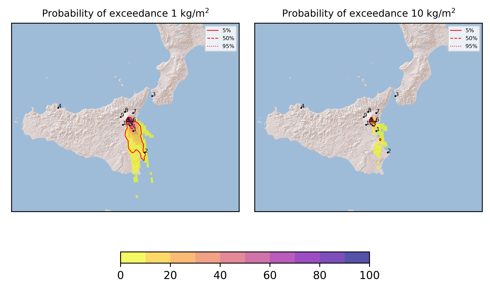  
  
  
  
  
  
  
  
  
  

|Location|Ground load [kg/m²] 5th perc|Ground load [kg/m²] 50th perc|Ground load [kg/m²] 95th perc|
| :--- | :--- | :--- | :--- |
|Catania AP (1)|4.68e-03|6.76e-01|7.99e+00|
|Siracusa (2)|0.00e+00|0.00e+00|8.40e-01|
|Reggio Calabria AP (3)|0.00e+00|0.00e+00|0.00e+00|
|Palermo AP (4)|0.00e+00|0.00e+00|0.00e+00|
|Nicolosi (5)|6.96e-02|1.11e+00|6.66e+00|
|Zafferana (6)|7.93e-05|6.71e-02|3.52e+00|
|Linguaglossa (7)|0.00e+00|0.00e+00|0.00e+00|
|Randazzo (8)|0.00e+00|0.00e+00|0.00e+00|
|Bronte (9)|0.00e+00|0.00e+00|1.20e-05|
|Biancavilla (10)|0.00e+00|7.16e-05|5.08e-03|
  

### Atmosphere 2021-09-14 15:00 Z
  
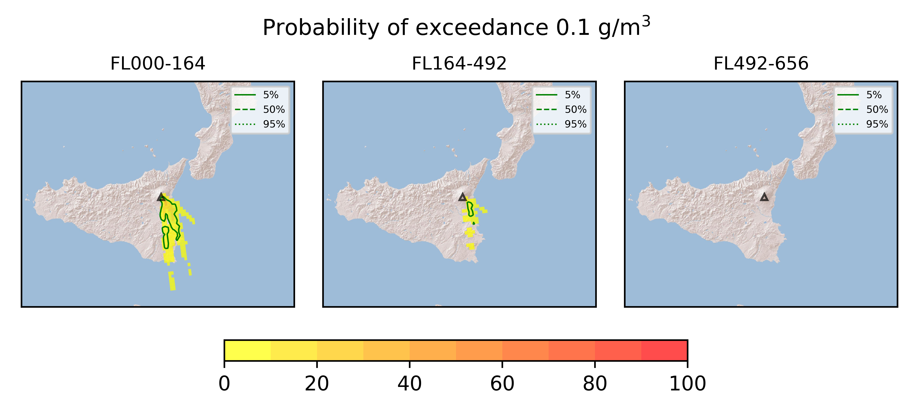
## Forecast at 2021-09-14 18:00 Z - Ongoing Eruption
  

|Eruption start [Z]|Eruption end [Z]|Forecast time [Z]|Column height asl [m]|
| :--- | :--- | :--- | :--- |
|2021-09-14 12:00:00|Ongoing|2021-09-14 18:00:00|[6000 m, 12000 m]|
  
  

|Percentile|MER [kg/s¹]|Mass in the air [kg]|Mass on the ground [kg]|
| :--- | :--- | :--- | :--- |
|5th|4.38e+04|3.68e+07|1.39e+09|
|50th|1.61e+05|3.22e+08|3.90e+09|
|95th|8.30e+05|1.02e+09|1.44e+10|
  

### Ground 2021-09-14 18:00 Z
  
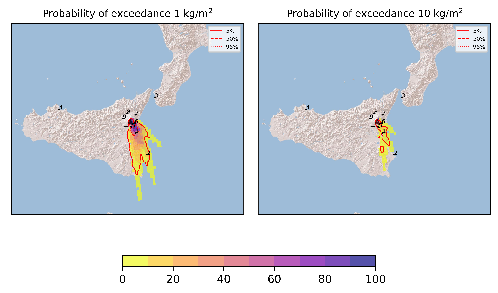  
  
  
  
  
  
  
  
  
  

|Location|Ground load [kg/m²] 5th perc|Ground load [kg/m²] 50th perc|Ground load [kg/m²] 95th perc|
| :--- | :--- | :--- | :--- |
|Catania AP (1)|1.53e-01|1.41e+00|1.26e+01|
|Siracusa (2)|0.00e+00|4.07e-03|1.84e+00|
|Reggio Calabria AP (3)|0.00e+00|0.00e+00|0.00e+00|
|Palermo AP (4)|0.00e+00|0.00e+00|0.00e+00|
|Nicolosi (5)|7.26e-01|3.03e+00|1.35e+01|
|Zafferana (6)|1.95e-03|3.79e-01|6.81e+00|
|Linguaglossa (7)|0.00e+00|0.00e+00|0.00e+00|
|Randazzo (8)|0.00e+00|0.00e+00|0.00e+00|
|Bronte (9)|0.00e+00|0.00e+00|1.20e-05|
|Biancavilla (10)|0.00e+00|2.56e-04|6.59e-03|
  

### Atmosphere 2021-09-14 18:00 Z
  
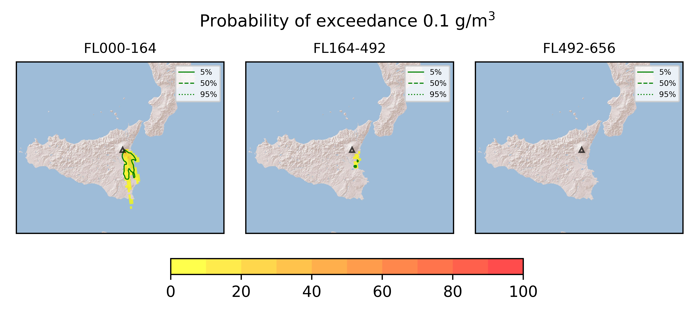
## Forecast at 2021-09-14 21:00 Z - Ongoing Eruption
  

|Eruption start [Z]|Eruption end [Z]|Forecast time [Z]|Column height asl [m]|
| :--- | :--- | :--- | :--- |
|2021-09-14 12:00:00|Ongoing|2021-09-14 21:00:00|[6000 m, 12000 m]|
  
  

|Percentile|MER [kg/s¹]|Mass in the air [kg]|Mass on the ground [kg]|
| :--- | :--- | :--- | :--- |
|5th|4.97e+04|4.85e+07|2.67e+09|
|50th|1.99e+05|3.17e+08|6.42e+09|
|95th|8.14e+05|1.41e+09|1.65e+10|
  

### Ground 2021-09-14 21:00 Z
  
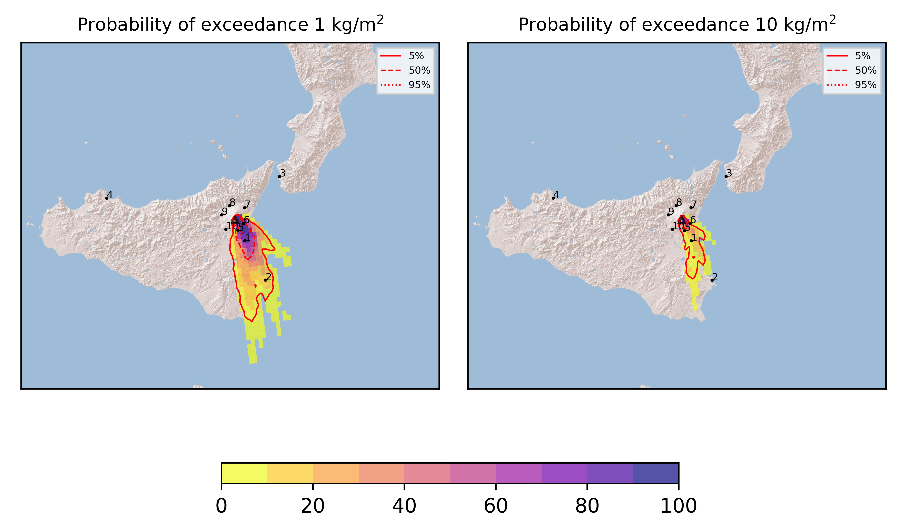  
  
  
  
  
  
  
  
  
  

|Location|Ground load [kg/m²] 5th perc|Ground load [kg/m²] 50th perc|Ground load [kg/m²] 95th perc|
| :--- | :--- | :--- | :--- |
|Catania AP (1)|4.43e-01|3.89e+00|1.79e+01|
|Siracusa (2)|6.06e-04|2.98e-02|2.46e+00|
|Reggio Calabria AP (3)|0.00e+00|0.00e+00|0.00e+00|
|Palermo AP (4)|0.00e+00|0.00e+00|0.00e+00|
|Nicolosi (5)|1.68e+00|4.75e+00|2.71e+01|
|Zafferana (6)|5.25e-02|2.05e+00|8.68e+00|
|Linguaglossa (7)|0.00e+00|0.00e+00|0.00e+00|
|Randazzo (8)|0.00e+00|0.00e+00|0.00e+00|
|Bronte (9)|0.00e+00|0.00e+00|1.20e-05|
|Biancavilla (10)|0.00e+00|2.93e-04|6.62e-03|
  

### Atmosphere 2021-09-14 21:00 Z
  

## Forecast at 2021-09-15 00:00 Z - Ongoing Eruption
  

|Eruption start [Z]|Eruption end [Z]|Forecast time [Z]|Column height asl [m]|
| :--- | :--- | :--- | :--- |
|2021-09-14 12:00:00|Ongoing|2021-09-15 00:00:00|[6000 m, 12000 m]|
  
  

|Percentile|MER [kg/s¹]|Mass in the air [kg]|Mass on the ground [kg]|
| :--- | :--- | :--- | :--- |
|5th|6.39e+04|5.11e+07|4.74e+09|
|50th|2.82e+05|3.69e+08|1.10e+10|
|95th|9.92e+05|4.13e+09|2.17e+10|
  

### Ground 2021-09-15 00:00 Z
  
  
  
  
  
  
  
  
  
  
  

|Location|Ground load [kg/m²] 5th perc|Ground load [kg/m²] 50th perc|Ground load [kg/m²] 95th perc|
| :--- | :--- | :--- | :--- |
|Catania AP (1)|9.49e-01|6.53e+00|2.12e+01|
|Siracusa (2)|1.10e-03|1.83e-01|3.84e+00|
|Reggio Calabria AP (3)|0.00e+00|0.00e+00|0.00e+00|
|Palermo AP (4)|0.00e+00|0.00e+00|0.00e+00|
|Nicolosi (5)|3.19e+00|6.68e+00|2.96e+01|
|Zafferana (6)|1.20e-01|2.79e+00|8.96e+00|
|Linguaglossa (7)|0.00e+00|0.00e+00|0.00e+00|
|Randazzo (8)|0.00e+00|0.00e+00|0.00e+00|
|Bronte (9)|0.00e+00|0.00e+00|1.20e-05|
|Biancavilla (10)|0.00e+00|2.93e-04|6.73e-03|
  

### Atmosphere 2021-09-15 00:00 Z
  
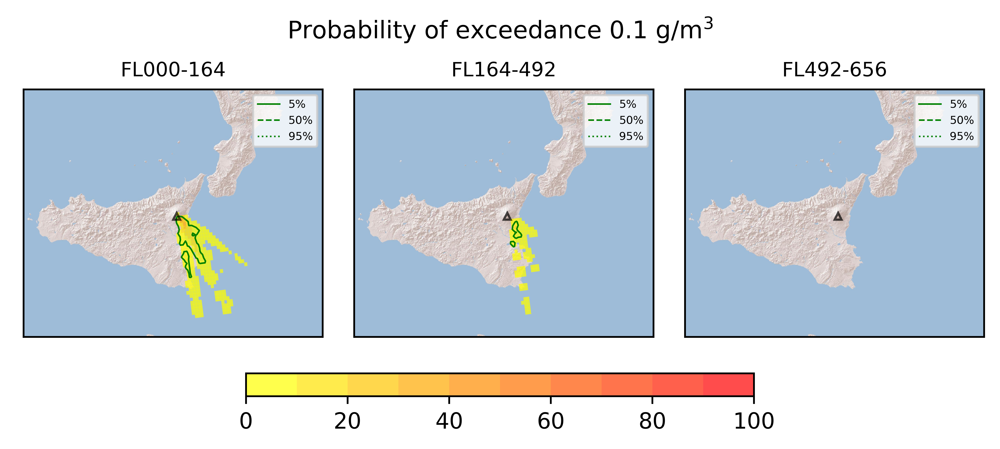
## Forecast at 2021-09-15 03:00 Z - Ongoing Eruption
  

|Eruption start [Z]|Eruption end [Z]|Forecast time [Z]|Column height asl [m]|
| :--- | :--- | :--- | :--- |
|2021-09-14 12:00:00|Ongoing|2021-09-15 03:00:00|[6000 m, 12000 m]|
  
  

|Percentile|MER [kg/s¹]|Mass in the air [kg]|Mass on the ground [kg]|
| :--- | :--- | :--- | :--- |
|5th|5.68e+04|6.83e+07|8.55e+09|
|50th|2.82e+05|3.10e+08|1.48e+10|
|95th|1.51e+06|7.00e+09|2.79e+10|
  

### Ground 2021-09-15 03:00 Z
  
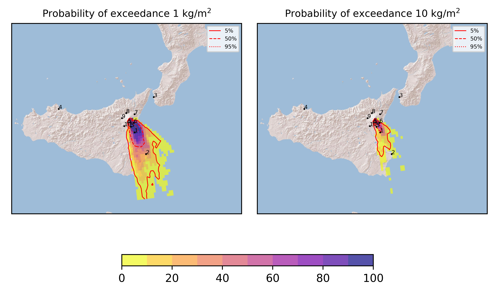  
  
  
  
  
  
  
  
  
  

|Location|Ground load [kg/m²] 5th perc|Ground load [kg/m²] 50th perc|Ground load [kg/m²] 95th perc|
| :--- | :--- | :--- | :--- |
|Catania AP (1)|1.14e+00|8.00e+00|2.48e+01|
|Siracusa (2)|1.83e-03|2.76e-01|5.59e+00|
|Reggio Calabria AP (3)|0.00e+00|0.00e+00|0.00e+00|
|Palermo AP (4)|0.00e+00|0.00e+00|0.00e+00|
|Nicolosi (5)|5.65e+00|1.09e+01|3.04e+01|
|Zafferana (6)|1.20e-01|4.27e+00|1.03e+01|
|Linguaglossa (7)|0.00e+00|0.00e+00|0.00e+00|
|Randazzo (8)|0.00e+00|0.00e+00|0.00e+00|
|Bronte (9)|0.00e+00|0.00e+00|1.20e-05|
|Biancavilla (10)|0.00e+00|4.65e-04|6.74e-03|
  

### Atmosphere 2021-09-15 03:00 Z
  
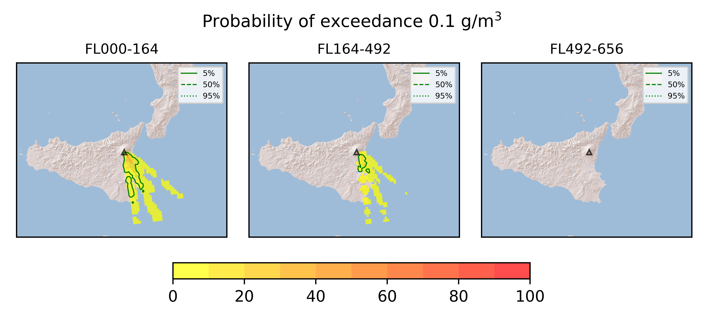
## Forecast at 2021-09-14 19:30 Z - Ongoing Eruption
  

|Eruption start [Z]|Eruption end [Z]|Forecast time [Z]|Column height asl [m]|
| :--- | :--- | :--- | :--- |
|2021-09-14 12:00:00|Ongoing|2021-09-14 19:30:00|9000 ± 500 - from VONA|
  
  

|Percentile|MER [kg/s¹]|Mass in the air [kg]|Mass on the ground [kg]|
| :--- | :--- | :--- | :--- |
|5th|1.22e+05|1.89e+08|2.08e+09|
|50th|2.32e+05|6.11e+08|4.59e+09|
|95th|3.55e+05|1.23e+09|1.36e+10|
  

### Ground 2021-09-14 19:30 Z
  
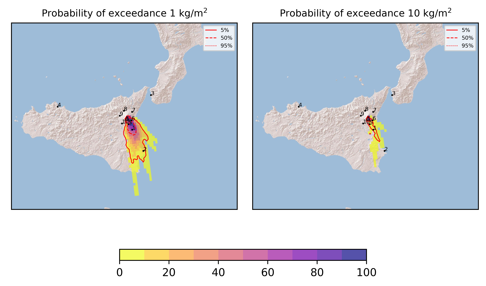  
  
  
  
  
  
  
  
  
  

|Location|Ground load [kg/m²] 5th perc|Ground load [kg/m²] 50th perc|Ground load [kg/m²] 95th perc|
| :--- | :--- | :--- | :--- |
|Catania AP (1)|3.20e-01|2.24e+00|1.11e+01|
|Siracusa (2)|0.00e+00|1.52e-02|1.84e+00|
|Reggio Calabria AP (3)|0.00e+00|0.00e+00|0.00e+00|
|Palermo AP (4)|0.00e+00|0.00e+00|0.00e+00|
|Nicolosi (5)|4.51e-01|3.96e+00|1.05e+01|
|Zafferana (6)|2.88e-03|4.65e-01|5.98e+00|
|Linguaglossa (7)|0.00e+00|0.00e+00|0.00e+00|
|Randazzo (8)|0.00e+00|0.00e+00|0.00e+00|
|Bronte (9)|0.00e+00|0.00e+00|1.20e-05|
|Biancavilla (10)|0.00e+00|1.92e-04|5.62e-03|
  

### Atmosphere 2021-09-14 19:30 Z
  
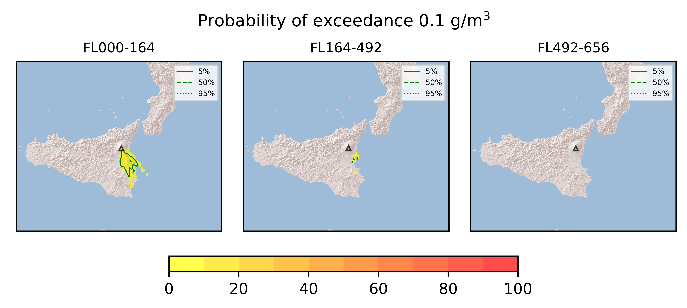
## Forecast at 2021-09-14 22:30 Z - Ongoing Eruption
  

|Eruption start [Z]|Eruption end [Z]|Forecast time [Z]|Column height asl [m]|
| :--- | :--- | :--- | :--- |
|2021-09-14 12:00:00|Ongoing|2021-09-14 22:30:00|9000 ± 500 - from VONA|
  
  

|Percentile|MER [kg/s¹]|Mass in the air [kg]|Mass on the ground [kg]|
| :--- | :--- | :--- | :--- |
|5th|1.41e+05|2.20e+08|4.57e+09|
|50th|2.71e+05|8.60e+08|6.67e+09|
|95th|4.06e+05|1.45e+09|1.60e+10|
  

### Ground 2021-09-14 22:30 Z
  
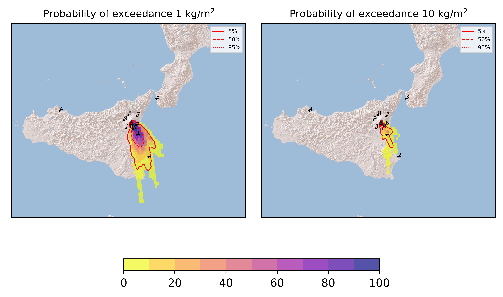  
  
  
  
  
  
  
  
  
  

|Location|Ground load [kg/m²] 5th perc|Ground load [kg/m²] 50th perc|Ground load [kg/m²] 95th perc|
| :--- | :--- | :--- | :--- |
|Catania AP (1)|1.17e+00|4.83e+00|1.48e+01|
|Siracusa (2)|3.67e-06|8.26e-02|2.18e+00|
|Reggio Calabria AP (3)|0.00e+00|0.00e+00|0.00e+00|
|Palermo AP (4)|0.00e+00|0.00e+00|0.00e+00|
|Nicolosi (5)|1.29e+00|6.71e+00|1.40e+01|
|Zafferana (6)|1.96e-02|7.51e-01|7.37e+00|
|Linguaglossa (7)|0.00e+00|0.00e+00|0.00e+00|
|Randazzo (8)|0.00e+00|0.00e+00|0.00e+00|
|Bronte (9)|0.00e+00|0.00e+00|1.20e-05|
|Biancavilla (10)|0.00e+00|3.97e-04|6.37e-03|
  

### Atmosphere 2021-09-14 22:30 Z
  
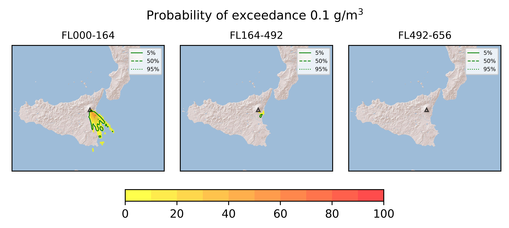
## Forecast at 2021-09-15 01:30 Z - Ongoing Eruption
  

|Eruption start [Z]|Eruption end [Z]|Forecast time [Z]|Column height asl [m]|
| :--- | :--- | :--- | :--- |
|2021-09-14 12:00:00|Ongoing|2021-09-15 01:30:00|9000 ± 500 - from VONA|
  
  

|Percentile|MER [kg/s¹]|Mass in the air [kg]|Mass on the ground [kg]|
| :--- | :--- | :--- | :--- |
|5th|1.60e+05|0.00e+00|5.64e+09|
|50th|3.17e+05|0.00e+00|8.14e+09|
|95th|5.04e+05|0.00e+00|1.81e+10|
  

### Ground 2021-09-15 01:30 Z
  
  
  
  
  
  
  
  
  
  
  

|Location|Ground load [kg/m²] 5th perc|Ground load [kg/m²] 50th perc|Ground load [kg/m²] 95th perc|
| :--- | :--- | :--- | :--- |
|Catania AP (1)|2.23e+00|6.09e+00|1.56e+01|
|Siracusa (2)|5.92e-06|2.06e-01|2.29e+00|
|Reggio Calabria AP (3)|0.00e+00|0.00e+00|0.00e+00|
|Palermo AP (4)|0.00e+00|0.00e+00|0.00e+00|
|Nicolosi (5)|2.61e+00|7.56e+00|1.54e+01|
|Zafferana (6)|1.73e-01|1.07e+00|7.38e+00|
|Linguaglossa (7)|0.00e+00|0.00e+00|0.00e+00|
|Randazzo (8)|0.00e+00|0.00e+00|0.00e+00|
|Bronte (9)|0.00e+00|0.00e+00|1.20e-05|
|Biancavilla (10)|0.00e+00|6.26e-04|6.46e-03|
  

### Atmosphere 2021-09-15 01:30 Z
  
  
Go to [Supplementary page](Supplementary_page.md)  
Go to [Main directory](https://github.com/federicapardini/Real_time_ash_forecast)