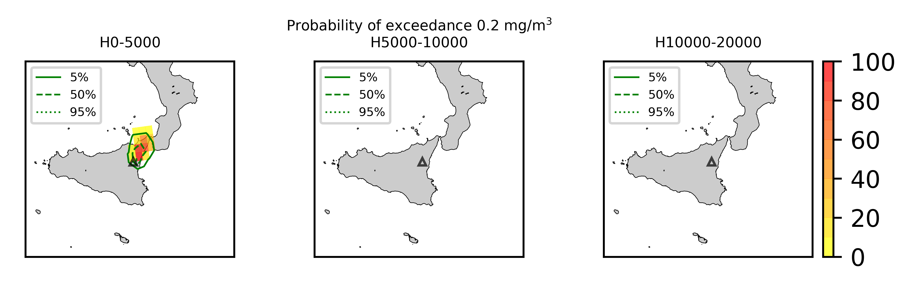

Forecast from VONA_20211023_0839Z
=================================

Contents
========

* [Forecast products](#forecast-products)
	* [Forecast at 2021-10-23 09:40 Z from RED VONA issued at 20211023_0839Z](#forecast-at-2021-10-23-0940-z-from-red-vona-issued-at-20211023_0839z)
	* [Forecast at 2021-10-23 10:40 Z from RED VONA issued at 20211023_0839Z](#forecast-at-2021-10-23-1040-z-from-red-vona-issued-at-20211023_0839z)
	* [Forecast at 2021-10-23 09:50 Z from RED VONA issued at 20211023_0854Z](#forecast-at-2021-10-23-0950-z-from-red-vona-issued-at-20211023_0854z)
	* [Forecast at 2021-10-23 10:50 Z from RED VONA issued at 20211023_0854Z](#forecast-at-2021-10-23-1050-z-from-red-vona-issued-at-20211023_0854z)
	* [Forecast at 2021-10-23 11:50 Z from RED VONA issued at 20211023_0854Z](#forecast-at-2021-10-23-1150-z-from-red-vona-issued-at-20211023_0854z)

# Forecast products

## Forecast at 2021-10-23 09:40 Z from RED VONA issued at 20211023_0839Z
  

|Eruption start [Z]|Eruption end [Z]|Forecast time [Z]|Column height asl [m]|
| :--- | :--- | :--- | :--- |
|2021-10-23 08:40:00|Ongoing|2021-10-23 09:40:00|5000 ± 500 - from VONA|
  
  

|Percentile|MER [kg/s¹]|Mass air [kg]|Mass air nested dom. [kg]|Mass grd [kg]|Mass grd nested dom. [kg]|
| :--- | :--- | :--- | :--- | :--- | :--- |
|5th|2.00e+03|1.25e+06|1.25e+06|7.02e+06|7.02e+06|
|50th|1.02e+04|7.96e+06|7.96e+06|3.05e+07|3.04e+07|
|95th|5.74e+04|4.37e+07|4.28e+07|1.52e+08|1.52e+08|
  

### Ground Nested Domain 2021-10-23 09:40 Z
  
  
  
  
  
  
  
  
  
  
  

|Location|Ground load [kg/m²] 5th perc|Ground load [kg/m²] 50th perc|Ground load [kg/m²] 95th perc|
| :--- | :--- | :--- | :--- |
|Catania AP (1)|0.00e+00|0.00e+00|0.00e+00|
|Siracusa (2)|nan|nan|nan|
|Reggio Calabria AP (3)|nan|nan|nan|
|Palermo AP (4)|nan|nan|nan|
|Nicolosi (5)|0.00e+00|0.00e+00|0.00e+00|
|Zafferana (6)|0.00e+00|0.00e+00|0.00e+00|
|Linguaglossa (7)|0.00e+00|4.99e-05|7.84e-02|
|Randazzo (8)|0.00e+00|0.00e+00|1.09e-04|
|Bronte (9)|0.00e+00|0.00e+00|0.00e+00|
|Biancavilla (10)|0.00e+00|0.00e+00|0.00e+00|
  

### Atmosphere 2021-10-23 09:40 Z
  

## Forecast at 2021-10-23 10:40 Z from RED VONA issued at 20211023_0839Z
  

|Eruption start [Z]|Eruption end [Z]|Forecast time [Z]|Column height asl [m]|
| :--- | :--- | :--- | :--- |
|2021-10-23 08:40:00|Ongoing|2021-10-23 10:40:00|5000 ± 500 - from VONA|
  
  

|Percentile|MER [kg/s¹]|Mass air [kg]|Mass air nested dom. [kg]|Mass grd [kg]|Mass grd nested dom. [kg]|
| :--- | :--- | :--- | :--- | :--- | :--- |
|5th|1.93e+03|1.97e+06|1.91e+06|1.71e+07|1.71e+07|
|50th|1.31e+04|1.74e+07|1.48e+07|1.06e+08|1.05e+08|
|95th|5.82e+04|6.48e+07|6.09e+07|2.35e+08|2.34e+08|
  

### Ground Nested Domain 2021-10-23 10:40 Z
  
  
  
  
  
  
  
  
  
  
  

|Location|Ground load [kg/m²] 5th perc|Ground load [kg/m²] 50th perc|Ground load [kg/m²] 95th perc|
| :--- | :--- | :--- | :--- |
|Catania AP (1)|0.00e+00|0.00e+00|0.00e+00|
|Siracusa (2)|nan|nan|nan|
|Reggio Calabria AP (3)|nan|nan|nan|
|Palermo AP (4)|nan|nan|nan|
|Nicolosi (5)|0.00e+00|0.00e+00|0.00e+00|
|Zafferana (6)|0.00e+00|0.00e+00|0.00e+00|
|Linguaglossa (7)|0.00e+00|2.41e-02|2.51e-01|
|Randazzo (8)|0.00e+00|0.00e+00|6.21e-04|
|Bronte (9)|0.00e+00|0.00e+00|0.00e+00|
|Biancavilla (10)|0.00e+00|0.00e+00|0.00e+00|
  

### Atmosphere 2021-10-23 10:40 Z
  

## Forecast at 2021-10-23 09:50 Z from RED VONA issued at 20211023_0854Z
  

|Eruption start [Z]|Eruption end [Z]|Forecast time [Z]|Column height asl [m]|
| :--- | :--- | :--- | :--- |
|2021-10-23 08:40:00|Ongoing|2021-10-23 09:50:00|7500 ± 500 - from VONA|
  
  

|Percentile|MER [kg/s¹]|Mass air [kg]|Mass air nested dom. [kg]|Mass grd [kg]|Mass grd nested dom. [kg]|
| :--- | :--- | :--- | :--- | :--- | :--- |
|5th|3.62e+04|2.50e+07|2.49e+07|1.14e+08|1.14e+08|
|50th|8.91e+04|1.05e+08|1.04e+08|2.32e+08|2.32e+08|
|95th|2.22e+05|2.68e+08|1.94e+08|6.15e+08|6.07e+08|
  

### Ground Nested Domain 2021-10-23 09:50 Z
  
  
  
  
  
  
  
  
  
  
  

|Location|Ground load [kg/m²] 5th perc|Ground load [kg/m²] 50th perc|Ground load [kg/m²] 95th perc|
| :--- | :--- | :--- | :--- |
|Catania AP (1)|0.00e+00|0.00e+00|0.00e+00|
|Siracusa (2)|nan|nan|nan|
|Reggio Calabria AP (3)|nan|nan|nan|
|Palermo AP (4)|nan|nan|nan|
|Nicolosi (5)|0.00e+00|0.00e+00|0.00e+00|
|Zafferana (6)|0.00e+00|1.93e-04|1.14e-01|
|Linguaglossa (7)|0.00e+00|6.24e-02|5.51e-01|
|Randazzo (8)|0.00e+00|0.00e+00|1.67e-05|
|Bronte (9)|0.00e+00|0.00e+00|0.00e+00|
|Biancavilla (10)|0.00e+00|0.00e+00|0.00e+00|
  

### Atmosphere 2021-10-23 09:50 Z
  

## Forecast at 2021-10-23 10:50 Z from RED VONA issued at 20211023_0854Z
  

|Eruption start [Z]|Eruption end [Z]|Forecast time [Z]|Column height asl [m]|
| :--- | :--- | :--- | :--- |
|2021-10-23 08:40:00|Ongoing|2021-10-23 10:50:00|7500 ± 500 - from VONA|
  
  

|Percentile|MER [kg/s¹]|Mass air [kg]|Mass air nested dom. [kg]|Mass grd [kg]|Mass grd nested dom. [kg]|
| :--- | :--- | :--- | :--- | :--- | :--- |
|5th|3.84e+04|5.00e+07|4.44e+07|3.50e+08|3.50e+08|
|50th|1.06e+05|1.36e+08|1.16e+08|6.07e+08|6.06e+08|
|95th|2.57e+05|3.87e+08|2.59e+08|1.08e+09|1.02e+09|
  

### Ground Nested Domain 2021-10-23 10:50 Z
  
  
  
  
  
  
  
  
  
  
  

|Location|Ground load [kg/m²] 5th perc|Ground load [kg/m²] 50th perc|Ground load [kg/m²] 95th perc|
| :--- | :--- | :--- | :--- |
|Catania AP (1)|0.00e+00|0.00e+00|0.00e+00|
|Siracusa (2)|nan|nan|nan|
|Reggio Calabria AP (3)|nan|nan|nan|
|Palermo AP (4)|nan|nan|nan|
|Nicolosi (5)|0.00e+00|0.00e+00|0.00e+00|
|Zafferana (6)|0.00e+00|3.17e-03|2.69e-01|
|Linguaglossa (7)|4.23e-02|3.07e-01|1.05e+00|
|Randazzo (8)|0.00e+00|0.00e+00|2.79e-04|
|Bronte (9)|0.00e+00|0.00e+00|0.00e+00|
|Biancavilla (10)|0.00e+00|0.00e+00|0.00e+00|
  

### Atmosphere 2021-10-23 10:50 Z
  

## Forecast at 2021-10-23 11:50 Z from RED VONA issued at 20211023_0854Z
  

|Eruption start [Z]|Eruption end [Z]|Forecast time [Z]|Column height asl [m]|
| :--- | :--- | :--- | :--- |
|2021-10-23 08:40:00|Ongoing|2021-10-23 11:50:00|7500 ± 500 - from VONA|
  
  

|Percentile|MER [kg/s¹]|Mass air [kg]|Mass air nested dom. [kg]|Mass grd [kg]|Mass grd nested dom. [kg]|
| :--- | :--- | :--- | :--- | :--- | :--- |
|5th|3.43e+04|5.64e+07|5.12e+07|6.11e+08|6.09e+08|
|50th|1.06e+05|1.81e+08|1.26e+08|1.05e+09|1.02e+09|
|95th|2.44e+05|3.71e+08|2.45e+08|1.71e+09|1.62e+09|
  

### Ground Nested Domain 2021-10-23 11:50 Z
  
  
  
  
  
  
  
  
  
  
  

|Location|Ground load [kg/m²] 5th perc|Ground load [kg/m²] 50th perc|Ground load [kg/m²] 95th perc|
| :--- | :--- | :--- | :--- |
|Catania AP (1)|0.00e+00|0.00e+00|0.00e+00|
|Siracusa (2)|nan|nan|nan|
|Reggio Calabria AP (3)|nan|nan|nan|
|Palermo AP (4)|nan|nan|nan|
|Nicolosi (5)|0.00e+00|0.00e+00|0.00e+00|
|Zafferana (6)|0.00e+00|8.25e-03|3.59e-01|
|Linguaglossa (7)|2.17e-01|6.09e-01|1.76e+00|
|Randazzo (8)|0.00e+00|6.17e-05|3.83e-03|
|Bronte (9)|0.00e+00|0.00e+00|0.00e+00|
|Biancavilla (10)|0.00e+00|0.00e+00|0.00e+00|
  

### Atmosphere 2021-10-23 11:50 Z
  
  
Go to [Supplementary page](Supplementary_page.md)  
Go to [Main directory](https://github.com/federicapardini/Real_time_ash_forecast)