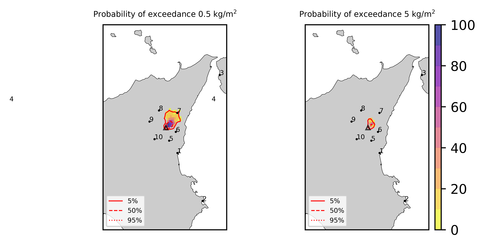
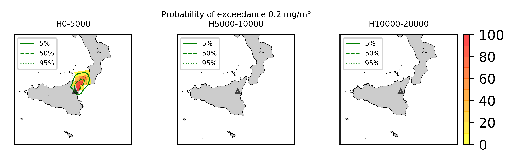

Forecast from VONA_20211023_0839Z
=================================

Contents
========

* [Forecast products](#forecast-products)
	* [Forecast at 2021-10-23 09:40 Z from RED VONA issued at 20211023_0839Z](#forecast-at-2021-10-23-0940-z-from-red-vona-issued-at-20211023_0839z)
	* [Forecast at 2021-10-23 10:40 Z from RED VONA issued at 20211023_0839Z](#forecast-at-2021-10-23-1040-z-from-red-vona-issued-at-20211023_0839z)
	* [Forecast at 2021-10-23 11:40 Z from RED VONA issued at 20211023_0839Z](#forecast-at-2021-10-23-1140-z-from-red-vona-issued-at-20211023_0839z)

# Forecast products

## Forecast at 2021-10-23 09:40 Z from RED VONA issued at 20211023_0839Z
  

|Eruption start [Z]|Eruption end [Z]|Forecast time [Z]|Column height asl [m]|
| :--- | :--- | :--- | :--- |
|2021-10-23 08:40:00|Ongoing|2021-10-23 09:40:00|5000 ± 500 - from VONA|
  
  

|Percentile|MER [kg/s¹]|Mass air [kg]|Mass air nested dom. [kg]|Mass grd [kg]|Mass grd nested dom. [kg]|
| :--- | :--- | :--- | :--- | :--- | :--- |
|5th|8.90e+02|6.15e+05|6.15e+05|2.96e+06|2.96e+06|
|50th|1.45e+04|1.31e+07|1.31e+07|4.24e+07|4.24e+07|
|95th|6.10e+04|4.49e+07|4.49e+07|1.69e+08|1.68e+08|
  

### Ground Nested Domain 2021-10-23 09:40 Z
  
  
  
  
  
  
  
  
  
  
  

|Location|Ground load [kg/m²] 5th perc|Ground load [kg/m²] 50th perc|Ground load [kg/m²] 95th perc|
| :--- | :--- | :--- | :--- |
|Catania AP (1)|0.00e+00|0.00e+00|0.00e+00|
|Siracusa (2)|0.00e+00|0.00e+00|0.00e+00|
|Reggio Calabria AP (3)|0.00e+00|0.00e+00|0.00e+00|
|Palermo AP (4)|nan|nan|nan|
|Nicolosi (5)|0.00e+00|0.00e+00|0.00e+00|
|Zafferana (6)|0.00e+00|0.00e+00|0.00e+00|
|Linguaglossa (7)|0.00e+00|2.65e-04|9.31e-02|
|Randazzo (8)|0.00e+00|0.00e+00|1.53e-04|
|Bronte (9)|0.00e+00|0.00e+00|0.00e+00|
|Biancavilla (10)|0.00e+00|0.00e+00|0.00e+00|
  

### Atmosphere 2021-10-23 09:40 Z
  

## Forecast at 2021-10-23 10:40 Z from RED VONA issued at 20211023_0839Z
  

|Eruption start [Z]|Eruption end [Z]|Forecast time [Z]|Column height asl [m]|
| :--- | :--- | :--- | :--- |
|2021-10-23 08:40:00|Ongoing|2021-10-23 10:40:00|5000 ± 500 - from VONA|
  
  

|Percentile|MER [kg/s¹]|Mass air [kg]|Mass air nested dom. [kg]|Mass grd [kg]|Mass grd nested dom. [kg]|
| :--- | :--- | :--- | :--- | :--- | :--- |
|5th|6.31e+02|1.15e+06|1.15e+06|2.64e+07|2.64e+07|
|50th|1.46e+04|1.63e+07|1.63e+07|1.14e+08|1.14e+08|
|95th|6.24e+04|5.56e+07|5.55e+07|2.44e+08|2.44e+08|
  

### Ground Nested Domain 2021-10-23 10:40 Z
  
  
  
  
  
  
  
  
  
  
  

|Location|Ground load [kg/m²] 5th perc|Ground load [kg/m²] 50th perc|Ground load [kg/m²] 95th perc|
| :--- | :--- | :--- | :--- |
|Catania AP (1)|0.00e+00|0.00e+00|0.00e+00|
|Siracusa (2)|0.00e+00|0.00e+00|0.00e+00|
|Reggio Calabria AP (3)|0.00e+00|0.00e+00|0.00e+00|
|Palermo AP (4)|nan|nan|nan|
|Nicolosi (5)|0.00e+00|0.00e+00|0.00e+00|
|Zafferana (6)|0.00e+00|0.00e+00|0.00e+00|
|Linguaglossa (7)|0.00e+00|2.60e-02|2.06e-01|
|Randazzo (8)|0.00e+00|0.00e+00|6.64e-04|
|Bronte (9)|0.00e+00|0.00e+00|0.00e+00|
|Biancavilla (10)|0.00e+00|0.00e+00|0.00e+00|
  

### Atmosphere 2021-10-23 10:40 Z
  

## Forecast at 2021-10-23 11:40 Z from RED VONA issued at 20211023_0839Z
  

|Eruption start [Z]|Eruption end [Z]|Forecast time [Z]|Column height asl [m]|
| :--- | :--- | :--- | :--- |
|2021-10-23 08:40:00|Ongoing|2021-10-23 11:40:00|5000 ± 500 - from VONA|
  
  

|Percentile|MER [kg/s¹]|Mass air [kg]|Mass air nested dom. [kg]|Mass grd [kg]|Mass grd nested dom. [kg]|
| :--- | :--- | :--- | :--- | :--- | :--- |
|5th|1.82e+03|6.49e+06|6.49e+06|6.49e+07|6.49e+07|
|50th|1.35e+04|1.24e+07|1.23e+07|1.76e+08|1.76e+08|
|95th|7.25e+04|8.08e+07|8.04e+07|4.02e+08|4.02e+08|
  

### Ground Nested Domain 2021-10-23 11:40 Z
  
  
  
  
  
  
  
  
  
  
  

|Location|Ground load [kg/m²] 5th perc|Ground load [kg/m²] 50th perc|Ground load [kg/m²] 95th perc|
| :--- | :--- | :--- | :--- |
|Catania AP (1)|0.00e+00|0.00e+00|0.00e+00|
|Siracusa (2)|0.00e+00|0.00e+00|0.00e+00|
|Reggio Calabria AP (3)|0.00e+00|0.00e+00|0.00e+00|
|Palermo AP (4)|nan|nan|nan|
|Nicolosi (5)|0.00e+00|0.00e+00|0.00e+00|
|Zafferana (6)|0.00e+00|0.00e+00|0.00e+00|
|Linguaglossa (7)|1.98e-04|4.46e-02|4.02e-01|
|Randazzo (8)|0.00e+00|1.83e-05|2.77e-03|
|Bronte (9)|0.00e+00|0.00e+00|0.00e+00|
|Biancavilla (10)|0.00e+00|0.00e+00|0.00e+00|
  

### Atmosphere 2021-10-23 11:40 Z
  
  
Go to [Supplementary page](Supplementary_page.md)  
Go to [Main directory](https://github.com/federicapardini/Real_time_ash_forecast)