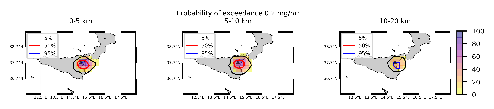

Forecast from VONA_20220221_1115Z
=================================

Contents
========

* [Forecast products](#forecast-products)
	* [Forecast at 2022-02-21 12:20 Z from RED VONA issued at 20220221_1115Z](#forecast-at-2022-02-21-1220-z-from-red-vona-issued-at-20220221_1115z)

# Forecast products

## Forecast at 2022-02-21 12:20 Z from RED VONA issued at 20220221_1115Z
  

|Eruption start [Z]|Eruption end [Z]|Forecast time [Z]|Column height asl [m]|
| :--- | :--- | :--- | :--- |
|2022-02-21 11:20:00|Ongoing|2022-02-21 12:20:00|[5000 m, 15000 m]|
  
  

|Percentile|MER [kg/s¹]|Mass air [kg]|Mass air nested dom. [kg]|Mass grd [kg]|Mass grd nested dom. [kg]|
| :--- | :--- | :--- | :--- | :--- | :--- |
|5th|3.13e+04|5.19e+07|5.18e+07|6.54e+07|6.54e+07|
|50th|4.29e+05|6.51e+08|6.49e+08|9.19e+08|9.18e+08|
|95th|5.71e+06|1.37e+10|1.36e+10|8.88e+09|8.85e+09|
  

### Ground Nested Domain 2022-02-21 12:20 Z
  
  
  
  
  
  
  
  

|Location|Ground load [kg/m²] 5th perc|Ground load [kg/m²] 50th perc|Ground load [kg/m²] 95th perc|
| :--- | :--- | :--- | :--- |
|Catania AP (1)|0.00e+00|6.22e-02|5.56e+00|
|Nicolosi (2)|0.00e+00|6.34e-01|1.62e+00|
|Zafferana (3)|1.99e-02|1.14e+00|1.51e+01|
|Linguaglossa (4)|0.00e+00|0.00e+00|2.35e-01|
|Randazzo (5)|0.00e+00|0.00e+00|4.74e-03|
|Bronte (6)|0.00e+00|0.00e+00|1.23e-03|
|Biancavilla (7)|0.00e+00|3.56e-04|2.34e-02|
  

### Atmosphere 2022-02-21 12:20 Z
  
  
Go to [Supplementary page](Supplementary_page.md)  
Go to [Main directory](https://github.com/federicapardini/Real_time_ash_forecast)