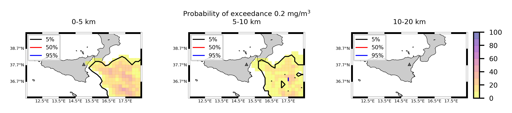

Forecast from VONA_20220221_1115Z
=================================

Contents
========

* [Forecast products](#forecast-products)
	* [Forecast at 2022-02-21 12:20 Z from RED VONA issued at 20220221_1115Z](#forecast-at-2022-02-21-1220-z-from-red-vona-issued-at-20220221_1115z)
	* [Forecast at 2022-02-21 12:30 Z from RED VONA issued at 20220221_1127Z](#forecast-at-2022-02-21-1230-z-from-red-vona-issued-at-20220221_1127z)
	* [Forecast at 2022-02-21 13:30 Z from RED VONA issued at 20220221_1127Z](#forecast-at-2022-02-21-1330-z-from-red-vona-issued-at-20220221_1127z)
	* [Forecast at 2022-02-21 14:30 Z from RED VONA issued at 20220221_1127Z](#forecast-at-2022-02-21-1430-z-from-red-vona-issued-at-20220221_1127z)
	* [Forecast at 2022-02-21 17:30 Z from RED VONA issued at 20220221_1127Z](#forecast-at-2022-02-21-1730-z-from-red-vona-issued-at-20220221_1127z)
	* [Forecast at 2022-02-21 20:10 Z from ORANGE VONA issued at 20220221_1711Z](#forecast-at-2022-02-21-2010-z-from-orange-vona-issued-at-20220221_1711z)

# Forecast products

## Forecast at 2022-02-21 12:20 Z from RED VONA issued at 20220221_1115Z
  

|Eruption start [Z]|Eruption end [Z]|Forecast time [Z]|Column height asl [m]|
| :--- | :--- | :--- | :--- |
|2022-02-21 11:20:00|Ongoing|2022-02-21 12:20:00|[5000 m, 15000 m]|
  
  

|Percentile|MER [kg/s¹]|Mass air [kg]|Mass air nested dom. [kg]|Mass grd [kg]|Mass grd nested dom. [kg]|
| :--- | :--- | :--- | :--- | :--- | :--- |
|5th|4.48e+04|6.54e+07|6.53e+07|1.15e+08|1.15e+08|
|50th|3.83e+05|6.50e+08|6.49e+08|7.48e+08|7.47e+08|
|95th|6.31e+06|1.38e+10|1.37e+10|6.73e+09|6.46e+09|
  

### Ground Nested Domain 2022-02-21 12:20 Z
  
  
  
  
  
  
  
  

|Location|Ground load [kg/m²] 5th perc|Ground load [kg/m²] 50th perc|Ground load [kg/m²] 95th perc|
| :--- | :--- | :--- | :--- |
|Catania AP (1)|0.00e+00|1.01e-02|4.67e+00|
|Nicolosi (2)|3.37e-04|3.43e-01|2.82e+00|
|Zafferana (3)|7.08e-03|9.98e-01|9.87e+00|
|Linguaglossa (4)|0.00e+00|0.00e+00|5.86e-02|
|Randazzo (5)|0.00e+00|0.00e+00|1.23e-03|
|Bronte (6)|0.00e+00|0.00e+00|1.67e-03|
|Biancavilla (7)|0.00e+00|2.71e-05|5.67e-02|
  

### Atmosphere 2022-02-21 12:20 Z
  

## Forecast at 2022-02-21 12:30 Z from RED VONA issued at 20220221_1127Z
  

|Eruption start [Z]|Eruption end [Z]|Forecast time [Z]|Column height asl [m]|
| :--- | :--- | :--- | :--- |
|2022-02-21 11:20:00|Ongoing|2022-02-21 12:30:00|10000 ± 500 - from VONA|
  
  

|Percentile|MER [kg/s¹]|Mass air [kg]|Mass air nested dom. [kg]|Mass grd [kg]|Mass grd nested dom. [kg]|
| :--- | :--- | :--- | :--- | :--- | :--- |
|5th|1.46e+05|2.48e+08|2.47e+08|5.65e+08|5.64e+08|
|50th|6.32e+05|1.11e+09|1.10e+09|1.73e+09|1.73e+09|
|95th|1.38e+06|2.97e+09|2.93e+09|5.17e+09|5.14e+09|
  

### Ground Nested Domain 2022-02-21 12:30 Z
  
  
  
  
  
  
  
  

|Location|Ground load [kg/m²] 5th perc|Ground load [kg/m²] 50th perc|Ground load [kg/m²] 95th perc|
| :--- | :--- | :--- | :--- |
|Catania AP (1)|1.16e-02|7.17e-01|3.15e+00|
|Nicolosi (2)|1.65e-01|7.48e-01|1.41e+00|
|Zafferana (3)|2.30e-01|1.79e+00|7.55e+00|
|Linguaglossa (4)|0.00e+00|0.00e+00|1.78e-02|
|Randazzo (5)|0.00e+00|0.00e+00|1.10e-04|
|Bronte (6)|0.00e+00|5.00e-06|1.15e-04|
|Biancavilla (7)|5.04e-04|3.77e-03|1.53e-02|
  

### Atmosphere 2022-02-21 12:30 Z
  

## Forecast at 2022-02-21 13:30 Z from RED VONA issued at 20220221_1127Z
  

|Eruption start [Z]|Eruption end [Z]|Forecast time [Z]|Column height asl [m]|
| :--- | :--- | :--- | :--- |
|2022-02-21 11:20:00|Ongoing|2022-02-21 13:30:00|10000 ± 500 - from VONA|
  
  

|Percentile|MER [kg/s¹]|Mass air [kg]|Mass air nested dom. [kg]|Mass grd [kg]|Mass grd nested dom. [kg]|
| :--- | :--- | :--- | :--- | :--- | :--- |
|5th|1.44e+05|4.02e+08|4.02e+08|1.92e+09|1.91e+09|
|50th|5.36e+05|1.32e+09|1.13e+09|3.18e+09|3.17e+09|
|95th|1.48e+06|3.17e+09|3.15e+09|8.92e+09|8.62e+09|
  

### Ground Nested Domain 2022-02-21 13:30 Z
  
  
  
  
  
  
  
  

|Location|Ground load [kg/m²] 5th perc|Ground load [kg/m²] 50th perc|Ground load [kg/m²] 95th perc|
| :--- | :--- | :--- | :--- |
|Catania AP (1)|4.32e-01|1.35e+00|7.59e+00|
|Nicolosi (2)|5.76e-01|1.31e+00|2.95e+00|
|Zafferana (3)|5.15e-01|3.25e+00|1.47e+01|
|Linguaglossa (4)|0.00e+00|1.28e-04|1.78e-02|
|Randazzo (5)|0.00e+00|0.00e+00|1.10e-04|
|Bronte (6)|0.00e+00|4.83e-05|4.18e-04|
|Biancavilla (7)|1.79e-03|1.46e-02|6.66e-02|
  

### Atmosphere 2022-02-21 13:30 Z
  

## Forecast at 2022-02-21 14:30 Z from RED VONA issued at 20220221_1127Z
  

|Eruption start [Z]|Eruption end [Z]|Forecast time [Z]|Column height asl [m]|
| :--- | :--- | :--- | :--- |
|2022-02-21 11:20:00|Ongoing|2022-02-21 14:30:00|10000 ± 500 - from VONA|
  
  

|Percentile|MER [kg/s¹]|Mass air [kg]|Mass air nested dom. [kg]|Mass grd [kg]|Mass grd nested dom. [kg]|
| :--- | :--- | :--- | :--- | :--- | :--- |
|5th|1.74e+05|7.14e+08|4.86e+08|3.84e+09|3.75e+09|
|50th|4.80e+05|1.39e+09|1.15e+09|5.46e+09|5.45e+09|
|95th|1.41e+06|2.90e+09|2.20e+09|1.13e+10|1.07e+10|
  

### Ground Nested Domain 2022-02-21 14:30 Z
  
  
  
  
  
  
  
  

|Location|Ground load [kg/m²] 5th perc|Ground load [kg/m²] 50th perc|Ground load [kg/m²] 95th perc|
| :--- | :--- | :--- | :--- |
|Catania AP (1)|8.71e-01|2.44e+00|8.68e+00|
|Nicolosi (2)|1.09e+00|1.85e+00|4.37e+00|
|Zafferana (3)|2.41e+00|5.48e+00|1.57e+01|
|Linguaglossa (4)|0.00e+00|2.75e-04|1.78e-02|
|Randazzo (5)|0.00e+00|0.00e+00|1.10e-04|
|Bronte (6)|0.00e+00|8.50e-05|4.18e-04|
|Biancavilla (7)|3.47e-03|1.93e-02|8.52e-02|
  

### Atmosphere 2022-02-21 14:30 Z
  

## Forecast at 2022-02-21 17:30 Z from RED VONA issued at 20220221_1127Z
  

|Eruption start [Z]|Eruption end [Z]|Forecast time [Z]|Column height asl [m]|
| :--- | :--- | :--- | :--- |
|2022-02-21 11:20:00|Ongoing|2022-02-21 17:30:00|10000 ± 500 - from VONA|
  
  

|Percentile|MER [kg/s¹]|Mass air [kg]|Mass air nested dom. [kg]|Mass grd [kg]|Mass grd nested dom. [kg]|
| :--- | :--- | :--- | :--- | :--- | :--- |
|5th|1.37e+05|6.50e+08|4.01e+08|7.72e+09|7.64e+09|
|50th|7.38e+05|2.25e+09|1.39e+09|1.27e+10|1.19e+10|
|95th|1.35e+06|3.90e+09|2.24e+09|2.38e+10|1.95e+10|
  

### Ground Nested Domain 2022-02-21 17:30 Z
  
  
  
  
  
  
  
  

|Location|Ground load [kg/m²] 5th perc|Ground load [kg/m²] 50th perc|Ground load [kg/m²] 95th perc|
| :--- | :--- | :--- | :--- |
|Catania AP (1)|1.36e+00|5.15e+00|9.99e+00|
|Nicolosi (2)|1.27e+00|3.42e+00|5.61e+00|
|Zafferana (3)|3.90e+00|1.18e+01|4.05e+01|
|Linguaglossa (4)|0.00e+00|1.33e-02|1.09e-01|
|Randazzo (5)|0.00e+00|0.00e+00|1.21e-03|
|Bronte (6)|0.00e+00|2.38e-04|5.60e-03|
|Biancavilla (7)|5.12e-03|3.00e-02|9.77e-02|
  

### Atmosphere 2022-02-21 17:30 Z
  

## Forecast at 2022-02-21 20:10 Z from ORANGE VONA issued at 20220221_1711Z
  

|Eruption start [Z]|Eruption end [Z]|Forecast time [Z]|Column height asl [m]|
| :--- | :--- | :--- | :--- |
|2022-02-21 11:20:00|2022-02-21 17:10:00|2022-02-21 20:10:00|10000 ± 500 - from VONA|
  
  

|Percentile|MER [kg/s¹]|Mass air [kg]|Mass air nested dom. [kg]|Mass grd [kg]|Mass grd nested dom. [kg]|
| :--- | :--- | :--- | :--- | :--- | :--- |
|5th|0.00e+00|4.17e+07|2.61e+03|7.94e+09|7.83e+09|
|50th|0.00e+00|2.52e+08|1.90e+04|1.41e+10|1.19e+10|
|95th|0.00e+00|1.17e+09|1.97e+06|2.52e+10|2.10e+10|
  

### Ground Nested Domain 2022-02-21 20:10 Z
  
  
  
  
  
  
  
  

|Location|Ground load [kg/m²] 5th perc|Ground load [kg/m²] 50th perc|Ground load [kg/m²] 95th perc|
| :--- | :--- | :--- | :--- |
|Catania AP (1)|1.49e+00|5.15e+00|9.61e+00|
|Nicolosi (2)|1.27e+00|3.40e+00|5.65e+00|
|Zafferana (3)|3.90e+00|1.19e+01|3.90e+01|
|Linguaglossa (4)|1.93e-04|1.30e-02|1.02e-01|
|Randazzo (5)|0.00e+00|3.33e-06|1.25e-03|
|Bronte (6)|0.00e+00|2.38e-04|5.46e-03|
|Biancavilla (7)|5.12e-03|2.96e-02|9.82e-02|
  

### Atmosphere 2022-02-21 20:10 Z
  
  
Go to [Supplementary page](Supplementary_page.md)  
Go to [Main directory](https://github.com/federicapardini/Real_time_ash_forecast)